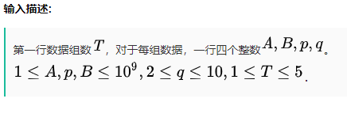
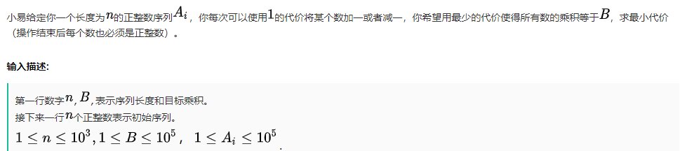
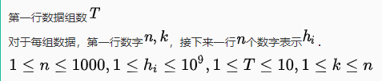
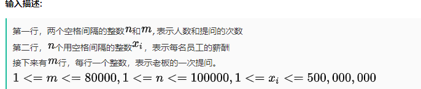

## 网易2020校招笔试- 系统开发/研发工程师（提前批） 
https://www.nowcoder.com/question/next?pid=20791627&qid=800697&tid=32356542

### [编程题]放置货物
    时间限制：C/C++ 1秒，其他语言2秒
    
    空间限制：C/C++ 32M，其他语言64M
    
    小易有一个体积巨大的货物，具体来说，是个在二维平面上占地的货物。
    小易有一个的广场，想把货物放在这个广场上。不幸的是，广场上已经有了一些障碍物，障碍物所在的格子不能放置你的货物。小易现在想知道能否成功地放置货物。
    
    输入描述:
    第一行数字t，表示有t组数据。
    对于每一组数据，第一行三个数字n,m,k，表示广场的大小和障碍物的个数。接下来k行，每行两个数x,y，表示一个障碍物的坐标。
    接下来一行两个数c,d，表示货物的大小。
    ，
    
    输出描述:
    对于每组数据，输出"YES"或者"NO"表示货物是否可以被放置。
    
    输入例子1:
    2
    3 3 1
    1 1
    2 2
    3 3 1  
    2 2  
    2 2  
    
    输出例子1:
    YES
    NO


​    
​    
​    
### [编程题]序列维护
    时间限制：C/C++ 3秒，其他语言6秒
       
    空间限制：C/C++ 256M，其他语言512M

   小易在维护数据的时候遇到一个需求，具体来说小易有一系列数据，这些数据了构成一个长度为n的数字序列，接下来小易会在这个序列上进行q次操作。
   每次操作有一个查询的数字x，小易需要将序列数据中所有大于等于x的数字都减一，并输出在本次操作中有多少个数字被减一了。
   小易犯了难，希望你能帮帮他。

   输入描述:
   第一行n,q，表示数字个数和操作个数。 
   接下来一行n个数表示初始的数字。 
   接下来q行，每行一个数，表示指定的数字x。
   ，

   输出描述:
   对于每个询问，输出一个数字表示答案

   输入例子1:
   4 3
   1 2 3 4
   4
   3
   1

   输出例子1:
   1
   2
   4

   输入例子2:
   3 2  
   1 2 3    
   3  
   3

   输出例子2:
   1
   0

   

### [编程题]按位或
    时间限制：C/C++ 1秒，其他语言2秒
    
    空间限制：C/C++ 256M，其他语言512M
    
    小易有一个初始为空的数字集合，支持两种操作：
    1、加入数字x到集合中。
    2、询问集合中是否存在一个子集，满足子集中所有数字的Or值恰好为k。
    Or为二进制按位或操作，C++中表示为"|"。
    小易希望你能解决这个问题。
    
    输入描述:
    第一行数字q,表示操作个数 
    接下来q行，每行两个数字： 
    1 x表示插入数字x 
    2 x表示询问数字x(即题设中询问的数值k)
     ,  。
    
    输出描述:
    对于每个询问，输出"YES"或者"NO"表示是否存在。
    
    输入例子1:
    9
    1 4
    2 5
    1 9
    1 15
    2 4
    1 11
    2 10
    2 7
    2 9
    
    输出例子1:
    NO
    YES
    NO
    NO
    YES 


​    
​    
##  网易2020校招笔试- 系统开发/研发工程师（正式批）
https://www.nowcoder.com/test/question/86b2100fc4cc4c788246d570ec8ad452?pid=20791607&tid=32356852

### [编程题]翻倍
时间限制：C/C++ 2秒，其他语言4秒

空间限制：C/C++ 256M，其他语言512M

小易给定你数字)和系数。每次操作你可以将变成或者将变成。问至少几次操作使得。


##### **输入描述:**



##### 输出描述:
对于每组数据，输出一个数字表示答案

输入例子1:
2
1 5 7 2
3 5 1 2

输出例子1:
1
2

输入例子2:
2
1 15 4 2
12 19 3 2

输出例子2:
3
3


```java
package com.nowcoder.train.netease;

import java.util.Scanner;

/**
 * AC
 * @Author GJXAIOU
 * @Date 2020/4/7 15:14
 */
public class FanBei {
    //方案一：递归
    public static void main(String[] args) {
        Scanner scanner = new Scanner(System.in);
        int lineNum = scanner.nextInt();
        scanner.nextLine();
        while (lineNum > 0) {
            String[] inputLineValue = scanner.nextLine().split(" ");
            long a = Long.parseLong(inputLineValue[0]);
            long b = Long.parseLong(inputLineValue[1]);
            long p = Long.parseLong(inputLineValue[2]);
            long q = Long.parseLong(inputLineValue[3]);
            int res = count(a, b, p, q, 0);
            System.out.println(res);
            lineNum--;
        }
    }

    // 递归
    // 每一步判断分为 A+P,中间 p+ q 或者 P 不加 q
    private static int count(long A, long B, long p, long q, int num) {
        if (B <= A + p) {
            return num + 1;
        } else if (B <= A + p * q) {
            return num + 2;
        } else {
            return count(A, B, p * q * q, q, num + 2);
        }
    }
}

```


### [编程题]乘积

时间限制：C/C++ 2秒，其他语言4秒

空间限制：C/C++ 256M，其他语言512M

小易给定你一个长度为的正整数序列，你每次可以使用的代价将某个数加一或者减一，你希望用最少的代价使得所有数的乘积等于，求最小代价（操作结束后每个数也必须是正整数）。

##### **输入描述:**



##### **输出描述:**

```
一行一个数字表示答案
```

##### **输入例子1:**

```
5 12
1 3 9 2 6
```

##### **输出例子1:**

```
10
```


##### **例子说明1:**

把3变为1需要2的代价，把9变为1需要8的代价，总代价为10。


##### **输入例子2:**

```
3 15
3 8 7
```


##### **输出例子2:**

```
9
```


##### **例子说明2:**

把8变为5需要3的代价，把7变为1需要6的代价，总代价为9。


### [编程题]跳柱子

时间限制：C/C++ 2秒，其他语言4秒

空间限制：C/C++ 256M，其他语言512M

小易有根柱子，第根柱子的高度为。一开始小易站在第一根柱子上。小易能从第根柱子跳到第根柱子，当且仅当且。其中为指定的一个数字。
另外小易拥有一次释放超能力的机会。这个超能力能让小易从柱子跳到任意满足的柱子而无视柱子高度的限制。
现在小易想知道，小易是否能到达第根柱子。


##### **输入描述:**




##### **输出描述:**

```
对于每组数据，输出YES或NO
```


##### **输入例子1:**

```
1
5 3
6 2 4 3 8
```


##### **输出例子1:**

```
YES
```


##### **输入例子2:**

```
1
5 2
1 8 2 3 4
```


##### **输出例子2:**

```
NO
```


 

### [编程题]人数统计

时间限制：C/C++ 2秒，其他语言4秒

空间限制：C/C++ 256M，其他语言512M

小易的公司一共有名员工, 第个人每个月的薪酬是万元。
现在小易的老板向小易提了次询问, 每次询问老板都会给出一个整数, 小易要快速回答老板工资等于的员工的数量。


##### **输入描述:**




##### **输出描述:**

```
m行，每行一个整数，表示对应提问的答案
```


##### **输入例子1:**

```
7 4
6 2 1 2 6 2 5
6
5
8
2
```


##### **输出例子1:**

```
2
1
0
3
```


```java
package com.nowcoder.train.netease;

import java.util.HashMap;
import java.util.Scanner;

/**
 * AC
 * @Author GJXAIOU
 * @Date 2020/4/7 16:12
 */
public class RenShuTongJi {
    public static void main(String[] args) {
        Scanner scanner = new Scanner(System.in);
        int workNum = scanner.nextInt();
        int searchNum = scanner.nextInt();
        scanner.nextLine();
        String[] workMoneyString = scanner.nextLine().split(" ");
        // 保存要查询的员工工资序号
        int[] search = new int[searchNum];
        int i = 0;
        while (i < searchNum) {
            search[i] = scanner.nextInt();
            i++;
        }
        int[] workMoney = new int[workNum];
        for (int j = 0; j < workMoneyString.length; j++) {
            workMoney[j] = Integer.parseInt(workMoneyString[j]);
        }

        HashMap<Integer, Integer> workMoneyMap = new HashMap<>();
        for (int k = 0; k < workMoney.length; k++) {
            if (workMoneyMap.containsKey(workMoney[k])) {
                int oldValue = workMoneyMap.get(workMoney[k]);
                workMoneyMap.replace(workMoney[k], oldValue, oldValue + 1);
            } else {
                workMoneyMap.put(workMoney[k], 1);
            }
        }


        // 查询
        for (int i1 = 0; i1 < search.length; i1++) {
            if (!workMoneyMap.containsKey(search[i1])){
                System.out.println(0);
            }else {
                int res =  workMoneyMap.get(search[i1]);
                System.out.println(res);
            }
        }

    }
}

```

