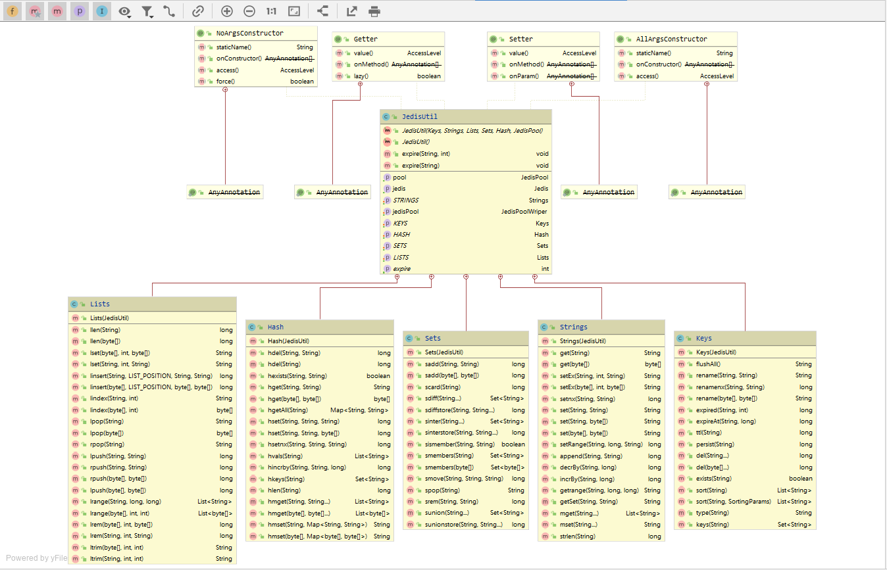

# README

🙋‍♂️：GJXAIOU

该小项目1.0 使用自己熟悉 SSM 框架，项目2.0使用将使用 SpringBoot 重新构建（待定），将在项目 2.0 完成之后部署到阿里云服务器。

## 一、项目说明

技术架构： Spring  + SpringMVC  + MyBatis + MySQL + Redis + SUI Mobile + jQuery

工具：IDEA + Maven + Tomcat + Kaptcha

特点：MySQL 主从同步实现读写分离，Redis 缓存，数据库加密设置

## 二、项目分解

- 通用模块
    - 通用 DAO 开发
    - Redis 访问层开发
    - 单元测试模块建立
- 数据备份模块
    - 搭建 MySQL 主从库

- 前端展示系统
  - 头条展示
  - 店铺类别展示
  - 区域详情展示
  - 店铺详情页开发
  - 搜索功能开发
  
- 商家模块
  - 账号维护
  - 店铺信息维护
  - 权限验证
  - 商品类别维护
- 超级管理员管理系统
  - 头条信息维护
  - 店铺类别信息维护
  - 区域信息维护
  - 权限验证
  - 店铺管理
  - 用户管理

## 二、数据库建表

- 数据库名称：`o2o`
- 数据表：
  - `tb_area`：区域信息；包括：区域ID、区域名称、区域权重、区域创建时间、区域修改时间；
  - `tb_head_line`：头条，即首页轮播图;包括：ID号、名称、图片、权重、状态、链接、创建时间、修改时间；
  - `tb_shop_category`：店铺类别；包括：店铺类别ID号、名称、权重、描述、图片、上级ID、创建时间、修改时间；
  - `tb_shop`：商铺信息；包括：店铺ID、店铺名称、店铺状态、店铺描述、店铺照片、店铺联系方式、店铺地址、店铺建议、店铺权重、店铺创建时间、店铺修改时间、店铺对应的区域ID、店铺对应的类别ID、店铺对应用户ID；
  - `tb_product_category`：商品类别；商品类别ID、店铺ID、商品类别名、商品类别描述、商品类别优先级、创建时间、修改时间；
  - `tb_product`：商品信息；包括：商品ID、商品名称、商品状态、商品描述、商品缩略图、商品原价、商品折扣价、商品权重、商品创建时间、商品修改时间、商品对应类别ID、商品对应店铺ID；
  - `tb_product_img`：商品图片；包括：商品图片ID、商品ID、图片地址、图片描述、图片优先级、创建时间、修改时间；
  - `tb_person_info`：用户信息；包括：用户ID、姓名、性别、头像、邮箱、状态、身份标识、创建时间、修改时间；
  - `tb_local_auth`：本地用户信息，包括：本地用户 id，用户 id，用户名，密码，创建时间；
  - `tb_wechat_auth`：微信用户信息；包括：微信open id、用户id、创建时间；


## 三、系统设计

### （一）根据数据库中表格生成对应的实体类（com.gjxaiou.entity）

- `Area.java`
- `Headline.java`
- `ShopCategory.java`
- `Shop.java`
- `ProductCategory.java`
- `Product.java`
- `ProductImg.java`
- `PersonInfo.java`
- `LocalAuth.java`
- `WeChatAuth.java`


### （二）Maven 配置

- 统一配置 Spring 版本为：`Spring 5.1.19.RELEASE`；参考[5.2.0 RELEASE Document](https://docs.spring.io/spring/docs/current/spring-framework-reference/)
- 因为是 Demo，会经常对自己代码进行调试，使用 `junit 4.12`；
- 一定要有的日志，这里使用 `logback 1.2.1`（log4j 的改良版）；
- `mysql-connectr-java`  为8.0.17 以及 `c3p0 0.9.1.2` 连接池；
- `Mybatis 3.4.2` 依赖以及 Mybatis 与 Spring依赖；
- Servlet 方面的以及 `stl 1.2` 以及使用` Jackson 2.9.5` 作为 json 解析；
- Map 工具类，对标准的 Java collection 的拓展；
- kaptcha：用于生成验证码；
- `lombok 1.18.10` 插件：为了自己做笔记方便，因此使用 lombok 插件；

## （三）SSM 整合验证

这里以实现区域查找功能为例，通过配置验证SSM配置；

- 首先是 SSM 基本配置：
    - `db.properties`  配置数据库连接信息；
    - `mybatis-config`配置 MyBatis 的全局属性，包括使用 jdbc 的 getGeneratedKeys 获取数据库的自增主键值；
    - `spring-dao.xml` 配置整合 Mybatis  的过程，包括数据库相关参数配置文件（db.properties）位置，数据库连接池（数据库连接池属性， 关闭自动提交等等），配置 SqlSessionFactory 对象，配置扫描 Dao 接口包，实现交由 Spring 容器管理；
    - `spring-service.xml` 首先配置扫描 service 包下面所有使用注解的类型，然后配置事务管理器，同时配置基于注解的声明式事务；
    - `spring-web.xml` 配置 SpringMVC，开启 SpringMVC 的注解模式，配置静态资源位置，自定义视图解析器，文件上传解析器；
    - `web.xml` 配置 DispatcherServlet，即 SpringMVC 需要加载的配置文件
    
- 日志配置：
  
    - 配置日志的记录级别，保存时间，输出位置，输出格式等；
    
    ## 四、具体实践

### （一）区域管理

- 功能一：列出所有的区域列表
  - 涉及的类
    - com.gjxaiou.dao.AreaDao.java
    - resources.mapper.AreaDao.xml
    - com.gjxaiou.service.AreaService.java
    - com.gjxaiou.sercive.impl.AreaService.java
    - com.gjxaiou.web.superadmin.AreaController.java
- 功能二：删除某个区域（待补充）

###  (二) 店铺类别管理

- 功能一：列出所有店铺类别

  - 涉及的类

    - com.gjxaiou.dao.ShopCategoryDao.java

    - resources.mapper.ShopCategoryDao.xml

    - com.gjxaiou.service.ShopCategoryService.java

    - com.gjxaiou.service.impl.ShopCategoryService.java

      

- 功能二：删除某个店铺类别（待补充）

### (三) 店铺管理

- 功能一：店铺


==注意：为什么使用 dto:==

DTO(data transfer object):数据传输对象，以前被称为值对象(VO,value object)，作用仅在于在应用程序的各个子系统间传输数据，在表现层展示。与POJO对应一个数据库实体不同，DTO并不对应一个实体，可能仅存储实体的部分属性或加入符合传输需求的其他的属性。																


- com.gjxaiou.entity：数据库表对应的实体类；
- Dao 层：
    - 首先创建 AreaDao 接口（com.gjxaiou.dao.AreaDao.java），声明查询区域列表的方法；
    - 然后创建 AreaDao.xml（resources.mapper.AreaDao.xml），其中 `namespace` 是声明对应的 Dao 接口，因为是查询要求，因此使用 `<select/>`标签，其中 `id ` 表示 对应的方法名，`resultType`表示返回值类型，这里只需要返回 `Area`对象即可；然后最后加上对应的 SQL 语句；
- service 层： AreaService.java 与  AreaServiceImpl.java   
    - service 层一般包含一个接口和一个实现类，接口是想要执行的方法，然后在实现类中实现该方法，该方法调用 Dao 层中的查询方法；
    - 其实现类 XXXService.xml 返回想要的数据是给 controller 中的；
    - 实现类中使用 `@Service` 和 `@Autowired` 表示交给 Spring 管理；
- Controller 层: AreaController.java（com.gjxaiou.web.superadmin.AreaController.java）
    - 首先 controller 层依赖于 service 层，因此首先创建 service 对象，将 service 实体类交个 Spring 管理；
    - 定义方法接受 service 层处理之后的对象，这里接收到的是 List 集合，这里使用 Map 存放返回值，因为是 `select`，所以返回的是受影响的行数；
    - 这里使用 logback 实现运行过程中的日志输出；
- 功能测试
  - 首先通过 BaseTest 类，实现初始化 Spring 容器，所有其他 Test 类都继承该类；
  - 验证 AreaDao 类，即调用查询方法，看结果和数据库中数据数目是否相同；
  - 验证 AreaServiceTest 类，可以查看查询里面具体内容是否和数据库中数据相同；

## （四）店铺商家管理系统
包括：店铺和商品模块
首先应该应有店铺然后才有商品模块，因此先从店铺商家管理系统开始设计，主要实现店铺的增删改查；


#### 1.Dao层

- shopDao
- shopExecution ：保存返回信息
- shopStateEnume：定义所有 shop 可能的返回值

#### 2.service 层（需要事务处理）
首先需要将店铺信息插入到数据库中，然后返回这个店铺的 Id，根据该店铺的 Id 创建存储该店铺图片的文件夹，在该文件夹下面处理图片，最后将文件夹地址更新会这条数据
以上任何一步出错都要回滚 -> 需要事务处理；

因此 店铺注册的逻辑中分为四步：①新增店铺信息；②返回店铺ID；③存储图片信息；④存储数据库 这是粗略的四个步骤，如果中间出错一步，整个过程将会回滚。注意：**Spring事务管理中只对运行期异常（RunTimeException）进行事务回滚。** 思考一：代码中将RunTimeException进行封装，业务将更加清晰； 思考二：存储图片时，如未上传图片，应添加默认图片，逻辑更加合理。 

#### 3.controller 层
放在包 web.shopadmin 下面，店家管理后台的 controller都放在这里

- ShopManagerController ：负责店铺管理相关逻辑
- HttpServletRequestUtil：负责解析 HttpServletRequest 请求的参数

注： pom 中 的 jackson-databind.jar 负责将实体类转换为 json或者反过来转换


#### 4.前端页面
使用 阿里巴巴的 SUI Mobile
使用这个 demo ：http://m.sui.taobao.org/demos/form/label-input/ ,然后右击获取源代码，并且引入静态资源（将 Link 和 script
 内容替换），参考：http://m.sui.taobao.org/getting-started/

 - 然后将页面放在 WEB-INF 下的 html/shop 下面，然后配置 shopadmin/shopAdminController.java 来访问，因为该文件夹下面资源文件不能直接访问；

 - 然后编写： webapp/resources/js/shop/shopOperation.js

 ### 需要的方法补写

 因为上面涉及到了 getshopinitinfo 方法，该方法返回区域和商铺类别相关信息，应为当前以及实现了区域列表，但是 shopCategory 还么有实现，所以从 dao层开始实现；
 - shopCategoryDao.java 和对应的 Mapper文件

 - service 层：一个接口，一个实现类
 - shopManagerController 中实现控制层： getinitinfo 方法，该方法获取区域和商铺类别相关信息然后返回给前台


### 上面 前端中的 验证码功能使用 ：
 - 导包 Kaptcha
 - web.xml 中使用servlet 生成验证码的相关设置
 - shopOperation.html 中引入验证码控件
 其中控件中有点击方法，点击就换一张验证码图片，因此使用 js/common/common.js 实现，然后在 shopOperation.js
    中将生成的验证码传入，最后在 shopOperation.HTML 中引入上面的 js
  
- 同样后端实现方法 CodeUtil.java 实现判断验证码是否正确  ;
- 最后在 ShopManagerController.java  的添加店铺之前进行验证


### thumbnailator 使用
1. 导包
2. util包下面添加 ImageUtil 方法
该方法中实现了图片的一般操作方法，这里的方法可以自定义。但是如果是批量处理图片，需要平凡的获取图片文件路径，
因此新建一个 PathUtil.java 类，里面实现获取输入文件路径和输出文件路径；


### （五）店铺信息的编辑

###### 实现目标：

- 实现单个店铺信息的获取；
- 实现对店铺信息进行修改；


#### 获取店铺信息

Dao：shopDao.java 中添加 查询方法；

配置 对应的 xml 方法；


Service 层：针对 ShopService 主要增加： 通过店铺 Id 获取店铺信息，和更新店铺信息（包括对图片的处理）

然后在对应的实现类中实现；

```
getByShopId
```

```
modifyShop
```


Controller 层：

前端：shopOperation.js  和 common.js


#### 分页查询展示店铺

整体的结构还是 shopDao.java /shopDao.xml/shopService.java/shopServiceImpl.java/shopListController.java

```java
 /**
     * 带有分页功能的查询商铺列表 。 可输入的查询条件：商铺名（要求模糊查询） 区域Id 商铺状态 商铺类别 owner
     * (注意在sqlmapper中按照前端入参拼装不同的查询语句)
     * @param shopCondition
     * @param rowIndex：从第几行开始取
     * @param pageSize：返回多少行数据（页面上的数据量）
     *                    比如 rowIndex为1,pageSize为5 即为 从第一行开始取，取5行数据
     */
    List<Shop> queryShopList(@Param("shopCondition") Shop shopCondition,
                             @Param("rowIndex") int rowIndex,
                             @Param("pageSize") int pageSize);
```

这里的 SQL 语句中，需要对输入的条件（shopCondition 中 shop 的各种属性）进行判断，因此使用 `<where></where>` 标签配合 `<if></if>`使用，进行动态 SQL 拼接，同时最后使用 ：`LIMIT #{rowIndex},#{pageSize}`进行分页。同时因为返回值为 shop对象（里面包含了其他的对象），因此采用 resultMap，里面通过组合 `<association> </association>`来实现 实体类和 数据表之间的映射；


对应到 Service 层中，因为用户传入的参数肯定是查看第几页和每页显示几条（pageIndex 和 pageSize），一次这里通过一个工具类：PageCalculator，通过：`rowIndex = (pageIndex - 1) * pageSize;`来计算从第几条开始显示；


### （六）商品类别列表展示

实体类是 ProductCategory

首先 Dao 层接口 ProductCategoryDao.java 和 对应的Mapper 然后使用 ProductCategoryTest 中 testAQueryByShopId 方法进行测试

然后是 Service 层 ProductCategoryService 和实现类；

最后是 controller 层 ProductCategoryManagementController

###### 前端页面：

product-category-management.html 和对应的 CSS 布局；和对应的 productCategoryManagement.js 文件 （最后通过标签将 CSS 、js 代码引入 html 中）

然后是 shopAdminController.java 中实现路由，通过访问

- #### 商品类别批量添加

// 说明待补充

- #### 商品类别删除

// 说明待补充


### 补充一：数据库实现主从读写分离

#### （一）数据库配置
MySQL 的主从复制功能不仅可以实现数据的多处自动备份，从而实现数据库的拓展。同时多个数据备份不仅可以加强数据的安全性，同时通过读写分离还能进一步提升数据库的负载性能。

在一主多从的数据库体系中，多个从服务器采用异步的方式更新主数据库的变化，**业务服务器在执行写或者相关修改数据库的操作是在主服务器上进行的，读操作则是在各从服务器上进行**。如果配置了多个从服务器或者多个主服务器又涉及到相应的负载均衡问题，关于负载均衡具体的技术细节还没有研究过，本项目中实现一主一从的主从复制功能，一主多从的复制和读写分离的模型见下：


- **主从同步工作过程：**

首先主服务器（Master）对数据的操作记录到二进制日志（Binary log）文件中（即在每个事务的更新事件完成之前，Master 在日志中都会记录这些改变，MySQL 串行的将事务写入二进制文件中，写入完成之后 Master 通知存储引擎提交事务），然后从服务器（Slave）开启一个 IO 线程保持与主服务器的同步，如果发现 Master 二进制日志文件发生改变， 将 binary log 拷贝然后写入从服务器的中继日志（ Relay log）中，即将主服务器的操作同步到 Relay log  中，最后从服务器重新开启一个 SQL线程，将刚才同步过来的操作在从服务器中进行执行，从而实现从数据库和主数据库的一致性，也实现了主从复制。


**具体配置：**
一共使用两台虚机实现数据库的读写分离，虚机一：CentOS7Mini：192.168.238.136，为主数据库，虚机二：CentOS7MiniClone：192.168.238.135，为从数据库；

*   主服务器：
    *   开启二进制日志
    *   配置唯一的 server-id
    *   获得 master 二进制日志文件名及位置
    *   创建一个用于 slave 和 master 通信的用户账号
*   从服务器：
    *   配置唯一的 server-id
    *   使用 master 分配的用户账号读取 master 二进制日志
    *   启用 slave 服务


- 虚拟机一：Master 主机
  - 修改 `/etc/my.cnf` 中配置 

```linux
server-id=1 # 设置 server-id
log-bin=master-bin # 开启二进制文件
log-bin-index=master-bin.index
```
- 然后进入 MySQL：
```mysql
create user 'repl'@'192.168.238.135' identified by 'GJXAIOU_o2o'; # 创建主从直接的通信账号
grant replication slave on *.* to 'repl'@'192.168.238.135';# 授予该账号读取主服务器中所有数据库的所有表的权限
```
- 然后重启数据库 ：`sudo service mysqld restart`
- 然后进入 MySQL：
```mysql
flush privileges;
show master status; # 查看二进制日志文件状态
```
这里结果如下：
```mysql
+----------+----------+--------------+------------------+-------------------+
| File  | Position | Binlog_Do_DB | Binlog_Ignore_DB | Executed_Gtid_Set |
+--------+----------+--------------+------------------+-------------------+
| master-bin.000002 |     1265 |          |              |                 |
+-------------+----------+------------+----------------+----------------+
1 row in set (0.00 sec)
```
- 注：如果配置错误，则可以在 mysql 中删除用户：`drop user 'repl'@'192.168.238.135'` 


- 虚拟机二中同样配置
  - 首先修改 `/etc/my.cnf`
```linux
server-id=2
relay-log-index=slave-relay-bin.index
relay-log=slave-relay-bin
```
- 从库重启 mysql 之后，打开 mysql 回话，执行下面语句；
```mysql
CHANGE MASTER TO  MASTER_HOST='192.168.238.136',master_user='repl',master_password='GJXAIOU_o2o',master_log_file='master-bin.000002',master_log_pos=1265;
```
访问主库的IP地址，从 3306端口访问，使用 repl 账号，密码是 GJXAIOU_o2o，读取的文件是 `master-bin.000002`，从 1265 位置开始读取；

- 开启主从跟踪和查看从库状态
```mysql
start slave; # 开启主从跟踪
show slave status \G; # 查看从库状态
```

- 可以使用 `stop slave`关闭主从跟踪；

**补充：设置还原**
当设置有问题的时候可以使用还原设置来重新配置；

- 主库设置还原：`reset master;`
- 从库设置还原：`reset slave all;`


**补充：从 Windows 导入数据库到 CentOS 中**
- 首先将 Windows  的数据库导出
cmd 中使用：`mysqldump -u用户名 -p 数据库名 数据表名 > 导出的数据库位置和名称`，这里是：`mysqldump -uroot -p o2o > D:\o2o.sql`
- 将该数据库导入到 CentOS 中
这里使用 xshell 连接服务器，首先需要在服务器中安装文件传输工具：lrzsz，命令为：`sudo yum install -y lrzsz`；
然后在 xshell 中找到该服务器的属性，设置文件的上传下载路径；
然后进入 CentOS 中的 o2o 目录中（自己定义 ），使用命令 ：`rz`然后回车，选择需要上传的文件即可；`rz`：表示上传，`sz`：表示下载；

- 导入数据库
服务器端进入数据库，然后新建数据库：`create database o2o;`，然后`use o2o;`，最后将上传的数据库文件导入：`source o2o.sql`，后面是刚才上传文件放置的位置；


#### （二）代码上实现读写分离

因为是 Dao层，因此创建包 `com.gjxaiou.dao.split`，里面放置读写分离的方法

- 新建 `DynamicDataSource.java`，该类中实现了 spring 中的 `determineCurrentLookupKey()` 方法，最终根据方法的返回值（key）的不同来区分不同的数据源；
这里调用了另一个类 DynamicDataSourceHolder 来具体设置 key 的值以及返回方法，

- 然后设置 mybatis 的拦截器，通过类 DynamicDataSourceInterceptor 完成，因为上面部分完成路由功能，但是使用该路由靠拦截器，因为拦截器会拦截 mybatis 传递进来的 SQL 信息，然后可以根据 SQL语句最前面的信息，如 insert 、update 则采用写的数据源，反之采用读的数据源；

- 然后在mybatis 配置文件mybatis-config 中配置拦截器；

- 最后在 Spring-dao.xml 中重新配置 DataSource，包括 db.properties属性值要分为主从分别配置；

### 补充二：权限管理

项目中一共有两处进行了权限管理：

- ShopLoginInterceptor：店家管理系统拦截器（ 针对登录店铺管理页面时进行拦截 ）
- shopPermissionInteceptor：店铺操作权限拦截器（ 对登录用户是否拥有店铺管理权限进行拦截 ）

#### （一）具体实现

这里的拦截器的实现，都是继承抽象类：HandlerInterceptorAdaptor（该抽象类实现了 AsyncHandlerInterceptor 接口，里面除了构造器之外还有四个方法：preHandle/postHandle/afterCompletion/afterConcurrentHandlingStarted），

- shopLoginInterceptor：主要是进行用户操作权限的拦截（必须登录才能操作店铺），因此属于事前拦截（即在用户操作之前进行拦截执行），因此只需要重写 PreHandle（） 方法即可；
  - 首先从 session 中根据 key：`user` 获取用户信息；
  - 然后判断用户信息是否存在，如果存在且状态正常（类型为店家）则返回 true，同时可进行后续操作；
  - 如果用户信息不存在则需要跳转用户登录状态；

- shopPermissionInteceptor：主要是判断当前登录的用户能否操作该店铺，因为也必须是在操作（controller ）之前进行判断，因此还是重写：PreHandle() 方法即可；
  - 首先从 session中的 request.getSession().getAttribute() 方法，通过 key：`currentShop`获取当前选择的店铺；
  - 然后从 session 中获取该用户可以操作的店铺列表；
  - 遍历返回的列表，使用 equals 方法比较 shopId 即可，如果在列表中，返回 true，可以继续操作；
  - 反之返回 false，提示没有操作权限即可；
- springMVC 的配置文件配置：在 spring-web.xml 文件中配置拦截器，因为这里是两个拦截器，需要分别进行配置；
  - 首先就是配置拦截器类的 <bean> 标签，然后配置该拦截器拦截哪些 controller，这里设置是：`path = "/shopAdmin/**"`，即拦截该包下面的所有controller。

#### （二）原理知识
- 这里实现自定义拦截器可以直接实现 HandlerInterceptor 接口或者继承实现上面接口的类（例如：HandlerInterceptorAdaptor )，这里使用后者；
- 拦截顺序：preHandle -> controller -> postHandle -> jsp -> afterCompletion；
- 多个拦截器拦截顺序：preHandle A -> preHandle B -> controller ->postHandle B -> postHandle A -> jsp -> afterCompletion B ->afterCompletion A；
- springMVC 拦截器与 AOP 区别：
  - spring MVC 拦截的是请求，即只能拦截 controller，发送请求时候被拦截器拦截，拦截之后在控制器前后增加额外的功能；
  - AOP 拦截的是方法，AOP 拦截的是特定的方法（被 Spring 管理，一般为 serviceImpl 中方法），并在其前后进行补充；


### 补充三：Redis

具体的内容见：Java -> JavaNotes -> Redis

同时可以参考博客： https://blog.csdn.net/tian330726/article/details/84332830 

#### （一）简介

- 首先 Redis 属于 NoSQL（非关系型数据库）中的**键值存储数据库**，该类型的数据库一般使用哈希表。Redis 中键可以包含：string，哈希, List, Set，zset。

- 优点:
  - 对数据高并发读写
  - 对海量数据的高效率存储和访问
因为是基于内存级别的读取操作
  - 对数据的可扩展性和高可用性
- 缺点: 
  - redis(ACID处理非常简单）无法做到太复杂的关系数据库模型

- 哨兵：
  - 主要是在 Redis 2.0 中的，用于对主服务器进行监控（3.0 之后使用集群）
  - 功能一：监控主数据库和从数据库是否正常运行；
  - 功能二：主数据库出现故障时候，可以自动将从数据库转换为主数据库，实现自动切换；
  - **redis持久化的两种方式：RDB 方式和 AOF**
    - 将内存中以快照的方式写入到二进制文件中,默认为 `dump.rdb` 可以通过配置设置自动做快照持久化的方式。我们可以配置redis 在n秒内如果超过m个key则修改就自动做快照。
    - redis会将每一个收到的写命令都通过 write 函数追加到命令中,当redis重新启动时会重新执行文件中保存的写命令来在内存中重建这个数据库的内容,这个文件在bin目录下 `appendonly.aof`。aof不是立即写到硬盘上,可以通过配置文件修改强制写到硬盘中。

#### （二）使用
这是使用 Redis 官方推荐的 Java 连接开发工具：Jedis
- 首先将 Redis 中的相关属性以 redis.properties 存储；
- 同样需要在 spring-redis.xml 中加载 redis.properties， 配置 redis 的连接池（包括：最大空闲连接数，最大等待时间、获取连接时候检查有效性）；这里创建 Redis 连接池的方式使用构造函数进行相关属性的注入（包括用户名、连接池、端口等）；同样将 Redis 的工具类进行配置；
- 上面的 Redis 连接池的构造函数是强指定的，
- 实现一个 Redis 工具类，就是将 Redis 中各种数据类型操作的方法进行了实现；



- 这里以 AreaServiceImpl 类中的 getAreaList（）中使用 Redis 为例：

  这里设置 key = AREA_LIST_KEY ，首先判断 keys类型对象 jedisKeys 中是否包括该 key，当然第一次时候是没有的，这时候调用 AreaDao 的 queryArea() 方法来查询数据并返回， 同时将返回结果转换为 JSON 字符串，最后将 key 和对应的 JSON字符串使用 set 方法保存到 value 类型为 String 的 jedisString 对象中。

  如果不是第一次访问，即相当于经过上一步之后 jedisKeys 中已经含有了对应的 key，这样就直接从 jedisString 对象中通过 key 就可以获取对应的 value 值，然后可以将其转换为 List 即可；


